# PortfolioRiskEngine

A C++ app/tool for basic risk analysis.

This project aims to create a tool that implements financial theorys to calculate analytics such as volatility using historical data.

My aim is to explore quantitative finance theories and concepts while refreshing and refining my C++ skills. 

## Architecture

The project follows a structure of a quantitative library that contains the business logic of the tool and executables that use the library.

Interface -----> Portfolio Service -----> Risk Engine -----> Data Models -----> Pricing Engine

## How to use:

The application for now relies on using a free data provider, Alpha Vantage, that requires an API key. In order to use the app an API key is needed. AlphaVantage provides site where a free API key can be obtain once signing up. 

----> https://www.alphavantage.co/support/#api-key <----- Alpha Vantage API Key

Step 1 ---> Get Alpha Vantage API key.

Step 2 ---> Create a system variable called "ALPHA_VANTAGE_API_KEY". (To be changed in later versions).

Step 3 ---> Download zip file and extract.

Step 4 ---> Run executable.

## Example use

The application starts with every field empty
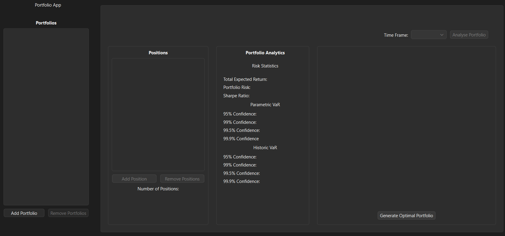

In order to use the application the first step would be to create a portfolio with any name.
Note that until a portfolio is created and selected buttons are disabled.
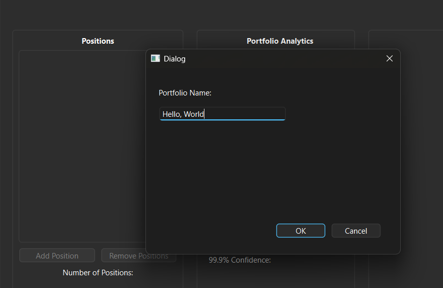
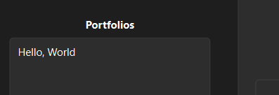
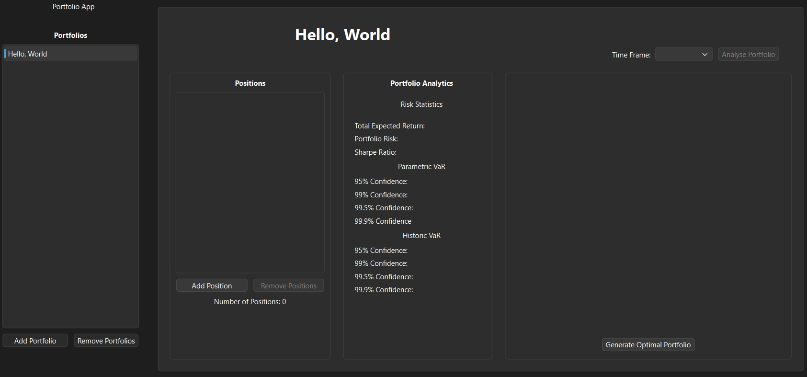

After selecting a portfolio the add position button will be enable allowing you to add a position. A Position requires a name, position type, quantity, buy-in price and an asset type. In order for the asset to be created and added to the portfolio a valid asset must be created.
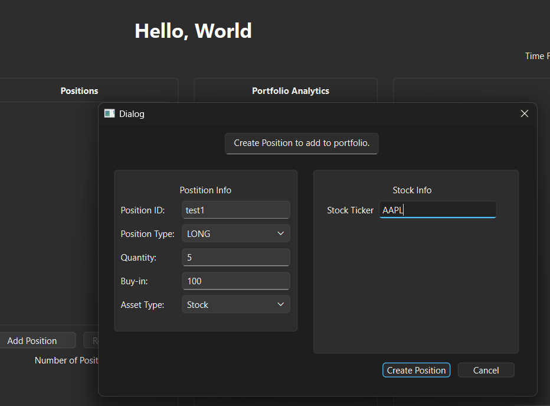

Multiple Positions can be added to a portfolio and multiple portfolios can be created.
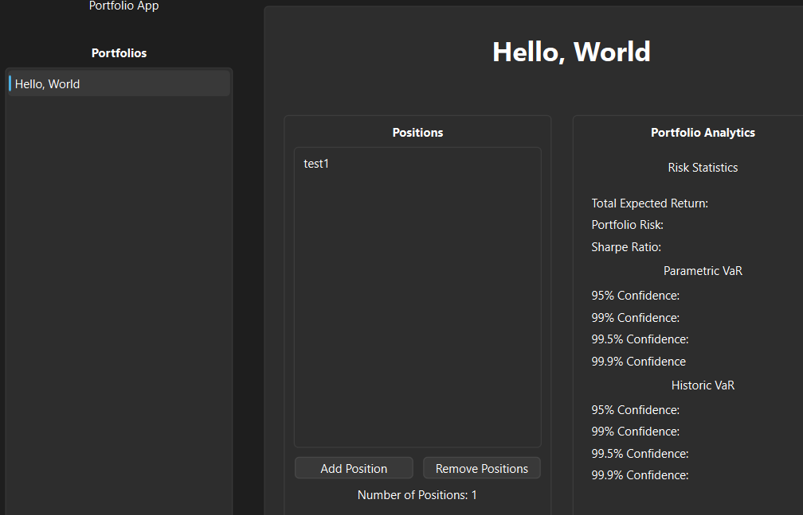
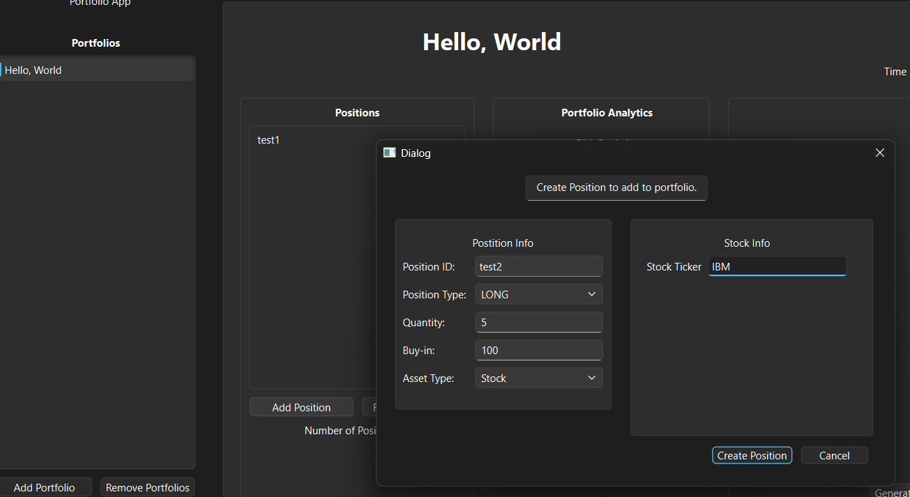
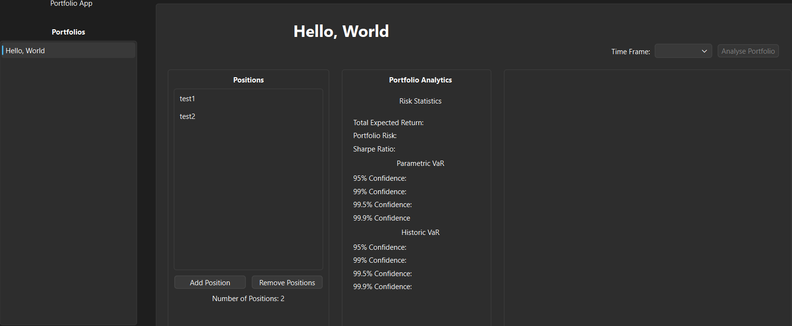
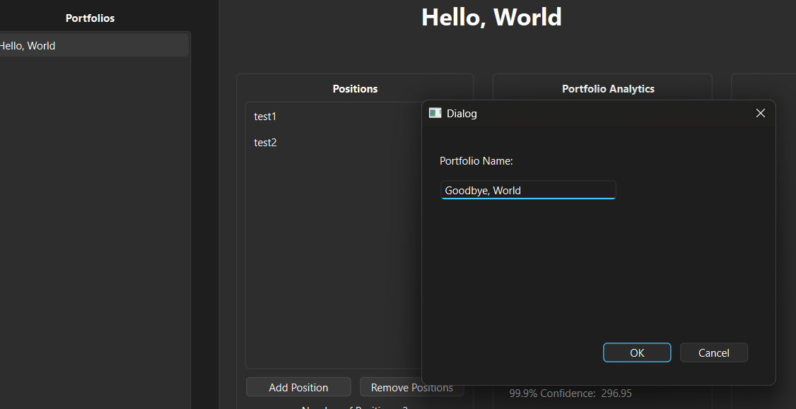
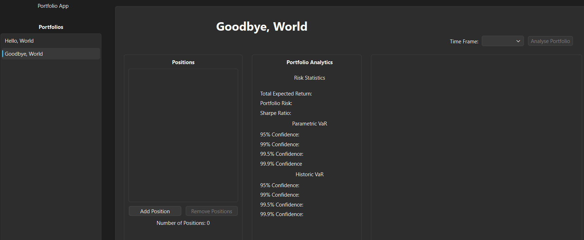

Until a time frame is selected the user can not analyse a portfolio.
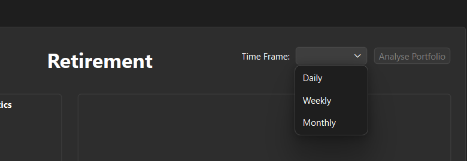

After selecting a time frame pressing the analyse button will fill the fields with calculated values.
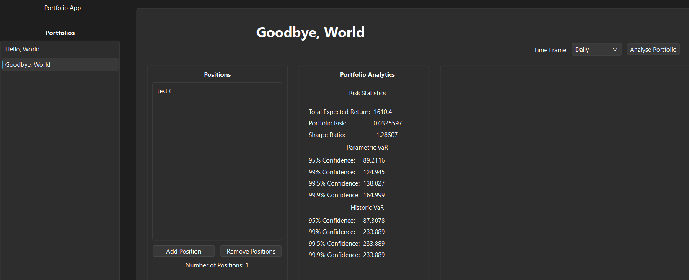

## Repository Structure

Apps/       # Applications that make use of the quantitative library

Assets/     # Contains the data models for financial instruments

Core/       # Contains objects that are used throughout every sub-library

DataLoader/     # Utility class for downloading csv data

docs/               # Diagrams, design notes, planning

MarketDataServices/     # Contains objects needed for data storage and data retrieval

out/        # Build diractory

PricingEngine/      # Contains the engines used for pricing financial instruments

tests/      # Contains End2End, financial validation, intergration and unit tests

CMakeLists.txt      # Build configuration

README.md           # Main documentation

.gitignore

## Future Features

    - Improve GUI
    - Monte Carlo portfolio simulation
    - Efficient frontier optimzation visualisation 